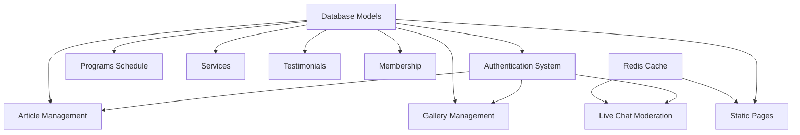

# El Shaddai FM Website Backend API Implementation Design

## Overview

This design document outlines the implementation strategy for the El Shaddai FM website backend API system. The project includes 24 distinct API endpoints organized into 8 main modules: authentication, articles, gallery, live chat, membership, pages, programs, services, and testimonials.

## Technology Stack & Dependencies

### Backend Framework
- **Runtime:** Node.js (LTS v20.x)
- **Framework:** Express.js with TypeScript
- **Database ORM:** Prisma with MySQL
- **Authentication:** JWT (JSON Web Tokens)
- **Real-time:** Socket.IO for WebSocket connections
- **Validation:** Zod schema validation
- **File Upload:** Multer middleware
- **Caching:** Redis for session management and caching
- **Testing:** Jest with Supertest for API testing

### Project Dependencies


## Architecture

### Module Organization
The backend follows a modular architecture with clear separation of concerns:

```
be/
├── src/
│   ├── controllers/     # Request handling logic
│   ├── services/        # Business logic layer
│   ├── middlewares/     # Authentication, validation, error handling
│   ├── routes/          # API endpoint definitions
│   ├── validators/      # Input validation schemas
│   └── app.ts          # Express application setup
├── prisma/
│   ├── migrations/      # Database schema migrations
│   └── seed/           # Database seeding scripts
└── tests/              # Unit and integration tests
```

### Core Middleware Stack
1. **Authentication Middleware** (`auth.middleware.ts`)
   - JWT token verification
   - User session validation
   - Role-based access control

2. **Validation Middleware** (`auth.validator.ts`)
   - Zod schema validation
   - Input sanitization
   - Error formatting

3. **Rate Limiting** (`rateLimiter.middleware.ts`)
   - Brute force protection
   - API abuse prevention
   - Per-endpoint rate limits

4. **Error Handling** (`error.middleware.ts`)
   - Global error catching
   - Standardized error responses
   - Logging integration

## API Endpoints Reference

### Authentication Module (`/auth`)

#### Admin Login - `POST /auth/login`
**Priority:** 1 | **Dependencies:** None

- **Request Schema:**
  ```typescript
  {
    email: string (email format),
    password: string (min: 8 chars)
  }
  ```

- **Response Schema:**
  ```typescript
  {
    accessToken: string (JWT),
    user: {
      id: number,
      name: string,
      email: string,
      role: 'admin' | 'editor' | 'penyiar'
    }
  }
  ```

- **Authentication:** None required
- **Rate Limiting:** 5 attempts per 15 minutes per IP

#### Admin Logout - `POST /auth/logout`
**Priority:** 2 | **Dependencies:** Admin Login

- **Authentication:** JWT required
- **Functionality:** Token blacklisting via Redis

#### Get User Profile - `GET /auth/me`
**Priority:** 3 | **Dependencies:** Admin Login

- **Authentication:** JWT required
- **Response:** Current user profile information

### Article Management Module (`/articles`)

#### List Articles - `GET /articles`
**Priority:** 20 | **Dependencies:** None

- **Query Parameters:**
  ```typescript
  {
    page?: number (default: 1),
    limit?: number (default: 10, max: 50),
    status?: 'draft' | 'published',
    category?: string,
    search?: string
  }
  ```

- **Response Schema:**
  ```typescript
  {
    data: Article[],
    pagination: {
      page: number,
      limit: number,
      total: number,
      totalPages: number
    }
  }
  ```

#### Get Article Detail - `GET /articles/:slug`
**Priority:** 21 | **Dependencies:** List Articles

- **Parameters:** `slug` (URL-safe string)
- **Response:** Complete article with content and metadata

#### Create Article - `POST /articles`
**Priority:** 50 | **Dependencies:** Admin Login

- **Authentication:** JWT required (Admin/Editor roles)
- **Request Schema:**
  ```typescript
  {
    title: string (required),
    content: string (required, HTML sanitized),
    slug?: string (auto-generated if not provided),
    status: 'draft' | 'published',
    category_id: number,
    author_id: number (from JWT)
  }
  ```

#### Update Article - `PUT /articles/:slug`
**Priority:** 51 | **Dependencies:** Create Article

- **Authentication:** JWT required (Admin/Editor roles)
- **Validation:** Ownership or admin role verification

#### Delete Article - `DELETE /articles/:slug`
**Priority:** 52 | **Dependencies:** Create Article

- **Authentication:** JWT required (Admin role only)
- **Functionality:** Soft delete with status update

### Gallery Management Module (`/gallery`)

#### List Gallery Items - `GET /gallery`
**Priority:** 35 | **Dependencies:** None

- **Query Parameters:** Pagination, filtering by type/date
- **Response:** Gallery items with thumbnail URLs

#### Upload Gallery Item - `POST /gallery`
**Priority:** 53 | **Dependencies:** Admin Login

- **Authentication:** JWT required (Admin/Editor roles)
- **File Upload:** Multer middleware for image processing
- **Validation:** File type, size limits, image dimensions

#### Update Gallery Item - `PUT /gallery/:id`
**Priority:** 54 | **Dependencies:** Upload Gallery Item

- **Authentication:** JWT required
- **Functionality:** Metadata updates, image replacement

#### Delete Gallery Item - `DELETE /gallery/:id`
**Priority:** 55 | **Dependencies:** Upload Gallery Item

- **Authentication:** JWT required (Admin role only)
- **Cleanup:** File system and database record removal

### Live Chat Module (`/livechat`)

#### Initiate Session - `POST /livechat/session`
**Priority:** 10 | **Dependencies:** None

- **Functionality:** Create chat session with unique identifier
- **Rate Limiting:** Session creation limits per IP

#### WebSocket Connection - `WEBSOCKET /livechat/ws`
**Priority:** 11 | **Dependencies:** Initiate Session

- **Protocol:** Socket.IO implementation
- **Events:** Message broadcasting, user join/leave
- **Redis Integration:** Multi-instance message synchronization

#### Moderate Message - `POST /livechat/messages/:id/moderate`
**Priority:** 12 | **Dependencies:** Admin Login

- **Authentication:** JWT required (Admin role only)
- **Actions:** Hide, delete, or flag inappropriate messages

### Membership Module (`/membership`)

#### Get Partnership Info - `GET /membership/info`
**Priority:** 40 | **Dependencies:** None

- **Response:** Available partnership tiers and benefits
- **Caching:** Redis cache for static content

#### Register Partnership - `POST /membership/register`
**Priority:** 41 | **Dependencies:** None

- **Validation:** Contact information, partnership type selection
- **Email Integration:** Automated notification system

### Static Pages Module (`/pages`)

#### Get Homepage Data - `GET /homepage`
**Priority:** 5 | **Dependencies:** None

- **Response:** Aggregated content for homepage
- **Caching:** Redis cache with TTL
- **Content:** Latest articles, schedule, announcements

#### Get Page Content - `GET /pages/:slug`
**Priority:** 6 | **Dependencies:** None

- **Response:** Static page content by slug identifier
- **Caching:** Redis cache for performance

### Programs Module (`/programs`)

#### Get Weekly Schedule - `GET /programs/schedule`
**Priority:** 30 | **Dependencies:** None

- **Response:** Weekly radio program schedule
- **Caching:** Redis cache with daily refresh
- **Query Parameters:** Week offset, program type filtering

### Services Module (`/services`)

#### Submit Prayer Request - `POST /services/prayer`
**Priority:** 15 | **Dependencies:** None

- **Rate Limiting:** Request submission limits
- **Validation:** Contact information, request content
- **Privacy:** Data handling compliance

#### Submit Song Request - `POST /services/song_request`
**Priority:** 16 | **Dependencies:** None

- **Real-time Integration:** Socket.IO notification to DJs
- **Validation:** Song information, requester details

### Testimonials Module (`/testimonials`)

#### List Testimonials - `GET /testimonials`
**Priority:** 25 | **Dependencies:** None

- **Query Parameters:** Pagination, approval status filtering
- **Response:** Published testimonials with metadata

#### Submit Testimonial - `POST /testimonials`
**Priority:** 26 | **Dependencies:** None

- **Validation:** Content moderation, contact information
- **Approval Workflow:** Admin review before publication

## Data Models & ORM Mapping

### Core Entities

```typescript
// User Model
model User {
  id        Int      @id @default(autoincrement())
  email     String   @unique
  password  String
  name      String
  role      Role     @default(EDITOR)
  createdAt DateTime @default(now())
  updatedAt DateTime @updatedAt
  
  articles  Article[]
}

// Article Model
model Article {
  id          Int      @id @default(autoincrement())
  title       String
  slug        String   @unique
  content     String   @db.Text
  status      Status   @default(DRAFT)
  authorId    Int
  categoryId  Int?
  publishedAt DateTime?
  createdAt   DateTime @default(now())
  updatedAt   DateTime @updatedAt
  
  author      User     @relation(fields: [authorId], references: [id])
  category    Category? @relation(fields: [categoryId], references: [id])
}

// Gallery Model
model Gallery {
  id          Int      @id @default(autoincrement())
  title       String
  description String?
  filename    String
  filepath    String
  mimetype    String
  size        Int
  uploadedBy  Int
  createdAt   DateTime @default(now())
  
  uploader    User     @relation(fields: [uploadedBy], references: [id])
}
```

### Relationship Mapping
- **Users** have many **Articles** (author relationship)
- **Articles** belong to **Categories** (optional)
- **Gallery** items belong to **Users** (uploader)
- **Chat Sessions** track user participation
- **Testimonials** require admin approval

## Business Logic Layer

### Authentication Service
```typescript
class AuthService {
  async login(email: string, password: string): Promise<LoginResponse>
  async logout(token: string): Promise<void>
  async validateToken(token: string): Promise<User>
  async hashPassword(password: string): Promise<string>
  async generateJWT(user: User): Promise<string>
}
```

### Article Service
```typescript
class ArticleService {
  async createArticle(data: CreateArticleDto): Promise<Article>
  async updateArticle(slug: string, data: UpdateArticleDto): Promise<Article>
  async deleteArticle(slug: string): Promise<void>
  async getArticles(filters: ArticleFilters): Promise<PaginatedResult<Article>>
  async getArticleBySlug(slug: string): Promise<Article | null>
  async generateUniqueSlug(title: string): Promise<string>
}
```

### Gallery Service
```typescript
class GalleryService {
  async uploadImage(file: MulterFile, userId: number): Promise<Gallery>
  async updateGalleryItem(id: number, data: UpdateGalleryDto): Promise<Gallery>
  async deleteGalleryItem(id: number): Promise<void>
  async getGalleryItems(filters: GalleryFilters): Promise<PaginatedResult<Gallery>>
}
```

## Middleware & Interceptors

### Request Flow Pipeline

```mermaid
graph LR
    A[Client Request] --> B[Rate Limiter]
    B --> C[CORS Handler]
    C --> D[JSON Parser]
    D --> E[Auth Middleware]
    E --> F[Role Validation]
    F --> G[Input Validation]
    G --> H[Controller]
    H --> I[Business Logic]
    I --> J[Database]
    J --> K[Response Handler]
    K --> L[Error Handler]
```


### Security Middleware
1. **JWT Verification**
   - Token validation and expiry checking
   - User session verification
   - Role-based access control

2. **Input Sanitization**
   - XSS prevention for HTML content
   - SQL injection protection via Prisma
   - File upload security validation

3. **Rate Limiting Strategy**
   - Global: 1000 requests per hour per IP
   - Auth endpoints: 5 attempts per 15 minutes
   - Upload endpoints: 10 files per hour
   - Chat endpoints: 100 messages per minute

## Testing Strategy

### Unit Testing Approach
- **Service Layer Testing**: Business logic validation
- **Middleware Testing**: Authentication and validation flows
- **Utility Function Testing**: Helper functions and utilities

### Integration Testing
- **API Endpoint Testing**: Complete request/response cycles
- **Database Integration**: Prisma model operations
- **External Service Integration**: Redis caching, file uploads

### Test Data Management
```typescript
// Test fixtures for consistent data
const testUsers = {
  admin: { email: 'admin@test.com', role: 'admin' },
  editor: { email: 'editor@test.com', role: 'editor' },
  regular: { email: 'user@test.com', role: 'user' }
}

const testArticles = {
  published: { title: 'Test Article', status: 'published' },
  draft: { title: 'Draft Article', status: 'draft' }
}
```

### Performance Testing
- **Load Testing**: Concurrent user simulation
- **Database Query Optimization**: N+1 query prevention
- **Caching Effectiveness**: Redis performance metrics
- **File Upload Performance**: Large file handling

## Security Considerations

### Authentication Security
- **JWT Secret Management**: Environment-based configuration
- **Token Expiry**: Short-lived access tokens (15 minutes)
- **Password Security**: bcrypt hashing with salt rounds
- **Session Management**: Redis-based token blacklisting

### Data Protection
- **Input Validation**: Comprehensive Zod schemas
- **SQL Injection Prevention**: Prisma ORM protection
- **XSS Prevention**: HTML content sanitization
- **File Upload Security**: Type validation, size limits

### API Security
- **CORS Configuration**: Restricted origin policies
- **Rate Limiting**: Multi-tier protection
- **HTTPS Enforcement**: Production security requirements
- **Error Handling**: Information disclosure prevention

## Performance Optimization

### Caching Strategy
```typescript
// Redis caching patterns
const cacheKeys = {
  homepage: 'homepage:data',
  schedule: 'programs:schedule:weekly',
  articles: (page: number) => `articles:page:${page}`,
  user: (id: number) => `user:${id}`
}

const cacheTTL = {
  homepage: 300,      // 5 minutes
  schedule: 86400,    // 24 hours
  articles: 1800,     // 30 minutes
  user: 3600          // 1 hour
}
```

### Database Optimization
- **Connection Pooling**: Prisma connection management
- **Query Optimization**: Selective field loading
- **Index Strategy**: Performance-critical queries
- **Pagination**: Limit-offset with total count optimization

### File Handling
- **Image Processing**: Thumbnail generation
- **Storage Strategy**: File system organization
- **CDN Integration**: Static asset delivery
- **Cleanup Jobs**: Orphaned file removal

## Error Handling & Logging

### Error Response Format
```typescript
interface ErrorResponse {
  success: false
  error: {
    code: string
    message: string
    details?: any
    timestamp: string
    requestId: string
  }
}
```

### Logging Strategy
- **Request Logging**: API endpoint access tracking
- **Error Logging**: Exception capture and analysis
- **Performance Logging**: Response time monitoring
- **Security Logging**: Authentication attempt tracking

## Deployment Considerations

### Environment Configuration
```typescript
// Environment variables
const config = {
  NODE_ENV: process.env.NODE_ENV,
  PORT: process.env.PORT || 3000,
  DATABASE_URL: process.env.DATABASE_URL,
  JWT_SECRET: process.env.JWT_SECRET,
  REDIS_URL: process.env.REDIS_URL,
  UPLOAD_PATH: process.env.UPLOAD_PATH
}
```

### Process Management
- **PM2 Configuration**: Multi-instance deployment
- **Health Checks**: Application monitoring
- **Graceful Shutdown**: Connection cleanup
- **Log Rotation**: File size management