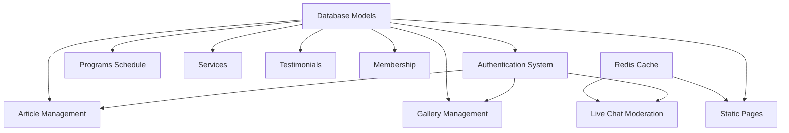
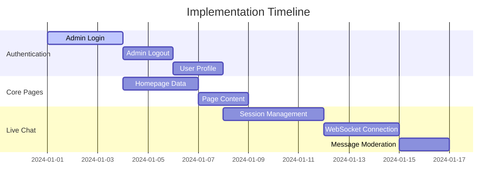

# El Shaddai FM Website Backend API Implementation Design

## Overview

This design document outlines the implementation strategy for the El Shaddai FM website backend API system. The project includes 24 distinct API endpoints organized into 8 main modules: authentication, articles, gallery, live chat, membership, pages, programs, services, and testimonials.

## Technology Stack & Dependencies

### Backend Framework
- **Runtime:** Node.js (LTS v20.x)
- **Framework:** Express.js with TypeScript
- **Database ORM:** Prisma with MySQL
- **Authentication:** JWT (JSON Web Tokens)
- **Real-time:** Socket.IO for WebSocket connections
- **Validation:** Zod schema validation
- **File Upload:** Multer middleware
- **Caching:** Redis for session management and caching
- **Testing:** Jest with Supertest for API testing

### Project Dependencies


## Architecture

### Module Organization
The backend follows a modular architecture with clear separation of concerns:

```
be/
├── src/
│   ├── controllers/     # Request handling logic
│   ├── services/        # Business logic layer
│   ├── middlewares/     # Authentication, validation, error handling
│   ├── routes/          # API endpoint definitions
│   ├── validators/      # Input validation schemas
│   └── app.ts          # Express application setup
├── prisma/
│   ├── migrations/      # Database schema migrations
│   └── seed/           # Database seeding scripts
└── tests/              # Unit and integration tests
```

### Core Middleware Stack
1. **Authentication Middleware** (`auth.middleware.ts`)
   - JWT token verification
   - User session validation
   - Role-based access control

2. **Validation Middleware** (`auth.validator.ts`)
   - Zod schema validation
   - Input sanitization
   - Error formatting

3. **Rate Limiting** (`rateLimiter.middleware.ts`)
   - Brute force protection
   - API abuse prevention
   - Per-endpoint rate limits

4. **Error Handling** (`error.middleware.ts`)
   - Global error catching
   - Standardized error responses
   - Logging integration

## API Endpoints Reference

### Authentication Module (`/auth`)

#### Admin Login - `POST /auth/login`
**Priority:** 1 | **Dependencies:** None

- **Request Schema:**
  ```typescript
  {
    email: string (email format),
    password: string (min: 8 chars)
  }
  ```

- **Response Schema:**
  ```typescript
  {
    accessToken: string (JWT),
    user: {
      id: number,
      name: string,
      email: string,
      role: 'admin' | 'editor' | 'penyiar'
    }
  }
  ```

- **Authentication:** None required
- **Rate Limiting:** 5 attempts per 15 minutes per IP

#### Admin Logout - `POST /auth/logout`
**Priority:** 2 | **Dependencies:** Admin Login

- **Authentication:** JWT required
- **Functionality:** Token blacklisting via Redis

#### Get User Profile - `GET /auth/me`
**Priority:** 3 | **Dependencies:** Admin Login

- **Authentication:** JWT required
- **Response:** Current user profile information

### Article Management Module (`/articles`)

#### List Articles - `GET /articles`
**Priority:** 20 | **Dependencies:** None

- **Query Parameters:**
  ```typescript
  {
    page?: number (default: 1),
    limit?: number (default: 10, max: 50),
    status?: 'draft' | 'published',
    category?: string,
    search?: string
  }
  ```

- **Response Schema:**
  ```typescript
  {
    data: Article[],
    pagination: {
      page: number,
      limit: number,
      total: number,
      totalPages: number
    }
  }
  ```

#### Get Article Detail - `GET /articles/:slug`
**Priority:** 21 | **Dependencies:** List Articles

- **Parameters:** `slug` (URL-safe string)
- **Response:** Complete article with content and metadata

#### Create Article - `POST /articles`
**Priority:** 50 | **Dependencies:** Admin Login

- **Authentication:** JWT required (Admin/Editor roles)
- **Request Schema:**
  ```typescript
  {
    title: string (required),
    content: string (required, HTML sanitized),
    slug?: string (auto-generated if not provided),
    status: 'draft' | 'published',
    category_id: number,
    author_id: number (from JWT)
  }
  ```

#### Update Article - `PUT /articles/:slug`
**Priority:** 51 | **Dependencies:** Create Article

- **Authentication:** JWT required (Admin/Editor roles)
- **Validation:** Ownership or admin role verification

#### Delete Article - `DELETE /articles/:slug`
**Priority:** 52 | **Dependencies:** Create Article

- **Authentication:** JWT required (Admin role only)
- **Functionality:** Soft delete with status update

### Gallery Management Module (`/gallery`)

#### List Gallery Items - `GET /gallery`
**Priority:** 35 | **Dependencies:** None

- **Query Parameters:** Pagination, filtering by type/date
- **Response:** Gallery items with thumbnail URLs

#### Upload Gallery Item - `POST /gallery`
**Priority:** 53 | **Dependencies:** Admin Login

- **Authentication:** JWT required (Admin/Editor roles)
- **File Upload:** Multer middleware for image processing
- **Validation:** File type, size limits, image dimensions

#### Update Gallery Item - `PUT /gallery/:id`
**Priority:** 54 | **Dependencies:** Upload Gallery Item

- **Authentication:** JWT required
- **Functionality:** Metadata updates, image replacement

#### Delete Gallery Item - `DELETE /gallery/:id`
**Priority:** 55 | **Dependencies:** Upload Gallery Item

- **Authentication:** JWT required (Admin role only)
- **Cleanup:** File system and database record removal

### Live Chat Module (`/livechat`)

#### Initiate Session - `POST /livechat/session`
**Priority:** 10 | **Dependencies:** None

- **Functionality:** Create chat session with unique identifier
- **Rate Limiting:** Session creation limits per IP

#### WebSocket Connection - `WEBSOCKET /livechat/ws`
**Priority:** 11 | **Dependencies:** Initiate Session

- **Protocol:** Socket.IO implementation
- **Events:** Message broadcasting, user join/leave
- **Redis Integration:** Multi-instance message synchronization

#### Moderate Message - `POST /livechat/messages/:id/moderate`
**Priority:** 12 | **Dependencies:** Admin Login

- **Authentication:** JWT required (Admin role only)
- **Actions:** Hide, delete, or flag inappropriate messages

### Membership Module (`/membership`)

#### Get Partnership Info - `GET /membership/info`
**Priority:** 40 | **Dependencies:** None

- **Response:** Available partnership tiers and benefits
- **Caching:** Redis cache for static content

#### Register Partnership - `POST /membership/register`
**Priority:** 41 | **Dependencies:** None

- **Validation:** Contact information, partnership type selection
- **Email Integration:** Automated notification system

### Static Pages Module (`/pages`)

#### Get Homepage Data - `GET /homepage`
**Priority:** 5 | **Dependencies:** None

- **Response:** Aggregated content for homepage
- **Caching:** Redis cache with TTL
- **Content:** Latest articles, schedule, announcements

#### Get Page Content - `GET /pages/:slug`
**Priority:** 6 | **Dependencies:** None

- **Response:** Static page content by slug identifier
- **Caching:** Redis cache for performance

### Programs Module (`/programs`)

#### Get Weekly Schedule - `GET /programs/schedule`
**Priority:** 30 | **Dependencies:** None

- **Response:** Weekly radio program schedule
- **Caching:** Redis cache with daily refresh
- **Query Parameters:** Week offset, program type filtering

### Services Module (`/services`)

#### Submit Prayer Request - `POST /services/prayer`
**Priority:** 15 | **Dependencies:** None

- **Rate Limiting:** Request submission limits
- **Validation:** Contact information, request content
- **Privacy:** Data handling compliance

#### Submit Song Request - `POST /services/song_request`
**Priority:** 16 | **Dependencies:** None

- **Real-time Integration:** Socket.IO notification to DJs
- **Validation:** Song information, requester details

### Testimonials Module (`/testimonials`)

#### List Testimonials - `GET /testimonials`
**Priority:** 25 | **Dependencies:** None

- **Query Parameters:** Pagination, approval status filtering
- **Response:** Published testimonials with metadata

#### Submit Testimonial - `POST /testimonials`
**Priority:** 26 | **Dependencies:** None

- **Validation:** Content moderation, contact information
- **Approval Workflow:** Admin review before publication

## Data Models & ORM Mapping

### Core Entities

```typescript
// User Model
model User {
  id        Int      @id @default(autoincrement())
  email     String   @unique
  password  String
  name      String
  role      Role     @default(EDITOR)
  createdAt DateTime @default(now())
  updatedAt DateTime @updatedAt
  
  articles  Article[]
}

// Article Model
model Article {
  id          Int      @id @default(autoincrement())
  title       String
  slug        String   @unique
  content     String   @db.Text
  status      Status   @default(DRAFT)
  authorId    Int
  categoryId  Int?
  publishedAt DateTime?
  createdAt   DateTime @default(now())
  updatedAt   DateTime @updatedAt
  
  author      User     @relation(fields: [authorId], references: [id])
  category    Category? @relation(fields: [categoryId], references: [id])
}

// Gallery Model
model Gallery {
  id          Int      @id @default(autoincrement())
  title       String
  description String?
  filename    String
  filepath    String
  mimetype    String
  size        Int
  uploadedBy  Int
  createdAt   DateTime @default(now())
  
  uploader    User     @relation(fields: [uploadedBy], references: [id])
}
```

### Relationship Mapping
- **Users** have many **Articles** (author relationship)
- **Articles** belong to **Categories** (optional)
- **Gallery** items belong to **Users** (uploader)
- **Chat Sessions** track user participation
- **Testimonials** require admin approval

## Business Logic Layer

### Authentication Service
```typescript
class AuthService {
  async login(email: string, password: string): Promise<LoginResponse>
  async logout(token: string): Promise<void>
  async validateToken(token: string): Promise<User>
  async hashPassword(password: string): Promise<string>
  async generateJWT(user: User): Promise<string>
}
```

### Article Service
```typescript
class ArticleService {
  async createArticle(data: CreateArticleDto): Promise<Article>
  async updateArticle(slug: string, data: UpdateArticleDto): Promise<Article>
  async deleteArticle(slug: string): Promise<void>
  async getArticles(filters: ArticleFilters): Promise<PaginatedResult<Article>>
  async getArticleBySlug(slug: string): Promise<Article | null>
  async generateUniqueSlug(title: string): Promise<string>
}
```

### Gallery Service
```typescript
class GalleryService {
  async uploadImage(file: MulterFile, userId: number): Promise<Gallery>
  async updateGalleryItem(id: number, data: UpdateGalleryDto): Promise<Gallery>
  async deleteGalleryItem(id: number): Promise<void>
  async getGalleryItems(filters: GalleryFilters): Promise<PaginatedResult<Gallery>>
}
```

## Middleware & Interceptors

### Request Flow Pipeline

```mermaid
graph LR
    A[Client Request] --> B[Rate Limiter]
    B --> C[CORS Handler]
    C --> D[JSON Parser]
    D --> E[Auth Middleware]
    E --> F[Role Validation]
    F --> G[Input Validation]
    G --> H[Controller]
    H --> I[Business Logic]
    I --> J[Database]
    J --> K[Response Handler]
    K --> L[Error Handler]
```


### Security Middleware
1. **JWT Verification**
   - Token validation and expiry checking
   - User session verification
   - Role-based access control

2. **Input Sanitization**
   - XSS prevention for HTML content
   - SQL injection protection via Prisma
   - File upload security validation

3. **Rate Limiting Strategy**
   - Global: 1000 requests per hour per IP
   - Auth endpoints: 5 attempts per 15 minutes
   - Upload endpoints: 10 files per hour
   - Chat endpoints: 100 messages per minute

## Testing Strategy

### Unit Testing Approach
- **Service Layer Testing**: Business logic validation
- **Middleware Testing**: Authentication and validation flows
- **Utility Function Testing**: Helper functions and utilities

### Integration Testing
- **API Endpoint Testing**: Complete request/response cycles
- **Database Integration**: Prisma model operations
- **External Service Integration**: Redis caching, file uploads

### Test Data Management
```typescript
// Test fixtures for consistent data
const testUsers = {
  admin: { email: 'admin@test.com', role: 'admin' },
  editor: { email: 'editor@test.com', role: 'editor' },
  regular: { email: 'user@test.com', role: 'user' }
}

const testArticles = {
  published: { title: 'Test Article', status: 'published' },
  draft: { title: 'Draft Article', status: 'draft' }
}
```

### Performance Testing
- **Load Testing**: Concurrent user simulation
- **Database Query Optimization**: N+1 query prevention
- **Caching Effectiveness**: Redis performance metrics
- **File Upload Performance**: Large file handling

## Security Considerations

### Authentication Security
- **JWT Secret Management**: Environment-based configuration
- **Token Expiry**: Short-lived access tokens (15 minutes)
- **Password Security**: bcrypt hashing with salt rounds
- **Session Management**: Redis-based token blacklisting

### Data Protection
- **Input Validation**: Comprehensive Zod schemas
- **SQL Injection Prevention**: Prisma ORM protection
- **XSS Prevention**: HTML content sanitization
- **File Upload Security**: Type validation, size limits

### API Security
- **CORS Configuration**: Restricted origin policies
- **Rate Limiting**: Multi-tier protection
- **HTTPS Enforcement**: Production security requirements
- **Error Handling**: Information disclosure prevention

## Performance Optimization

### Caching Strategy
```typescript
// Redis caching patterns
const cacheKeys = {
  homepage: 'homepage:data',
  schedule: 'programs:schedule:weekly',
  articles: (page: number) => `articles:page:${page}`,
  user: (id: number) => `user:${id}`
}

const cacheTTL = {
  homepage: 300,      // 5 minutes
  schedule: 86400,    // 24 hours
  articles: 1800,     // 30 minutes
  user: 3600          // 1 hour
}
```

### Database Optimization
- **Connection Pooling**: Prisma connection management
- **Query Optimization**: Selective field loading
- **Index Strategy**: Performance-critical queries
- **Pagination**: Limit-offset with total count optimization

### File Handling
- **Image Processing**: Thumbnail generation
- **Storage Strategy**: File system organization
- **CDN Integration**: Static asset delivery
- **Cleanup Jobs**: Orphaned file removal

## Error Handling & Logging

### Error Response Format
```typescript
interface ErrorResponse {
  success: false
  error: {
    code: string
    message: string
    details?: any
    timestamp: string
    requestId: string
  }
}
```

### Logging Strategy
- **Request Logging**: API endpoint access tracking
- **Error Logging**: Exception capture and analysis
- **Performance Logging**: Response time monitoring
- **Security Logging**: Authentication attempt tracking

## Deployment Considerations

### Environment Configuration
```typescript
// Environment variables
const config = {
  NODE_ENV: process.env.NODE_ENV,
  PORT: process.env.PORT || 3000,
  DATABASE_URL: process.env.DATABASE_URL,
  JWT_SECRET: process.env.JWT_SECRET,
  REDIS_URL: process.env.REDIS_URL,
  UPLOAD_PATH: process.env.UPLOAD_PATH
}
```

### Process Management
- **PM2 Configuration**: Multi-instance deployment
- **Health Checks**: Application monitoring
- **Graceful Shutdown**: Connection cleanup
- **Log Rotation**: File size management

## Implementation Roadmap

### Phase 1: Foundation (Priority 1-10)


### Phase 2: Content Management (Priority 20-30)
- Article CRUD operations
- Program schedule management
- Basic content caching

### Phase 3: User Interaction (Priority 35-45)
- Gallery management
- Membership system
- Service request handling

### Phase 4: Advanced Features (Priority 50+)
- Advanced article management
- Complete gallery operations
- Performance optimization

## Database Schema Implementation

### Core Tables Structure
```sql
-- Users table
CREATE TABLE users (
  id INT AUTO_INCREMENT PRIMARY KEY,
  email VARCHAR(255) UNIQUE NOT NULL,
  password_hash VARCHAR(255) NOT NULL,
  name VARCHAR(255) NOT NULL,
  role ENUM('admin', 'editor', 'penyiar') DEFAULT 'editor',
  is_active BOOLEAN DEFAULT TRUE,
  created_at TIMESTAMP DEFAULT CURRENT_TIMESTAMP,
  updated_at TIMESTAMP DEFAULT CURRENT_TIMESTAMP ON UPDATE CURRENT_TIMESTAMP,
  INDEX idx_email (email),
  INDEX idx_role (role)
);

-- Categories table
CREATE TABLE categories (
  id INT AUTO_INCREMENT PRIMARY KEY,
  name VARCHAR(255) NOT NULL,
  slug VARCHAR(255) UNIQUE NOT NULL,
  description TEXT,
  created_at TIMESTAMP DEFAULT CURRENT_TIMESTAMP,
  INDEX idx_slug (slug)
);

-- Articles table
CREATE TABLE articles (
  id INT AUTO_INCREMENT PRIMARY KEY,
  title VARCHAR(500) NOT NULL,
  slug VARCHAR(500) UNIQUE NOT NULL,
  content LONGTEXT NOT NULL,
  excerpt TEXT,
  status ENUM('draft', 'published', 'archived') DEFAULT 'draft',
  author_id INT NOT NULL,
  category_id INT,
  featured_image VARCHAR(500),
  published_at TIMESTAMP NULL,
  created_at TIMESTAMP DEFAULT CURRENT_TIMESTAMP,
  updated_at TIMESTAMP DEFAULT CURRENT_TIMESTAMP ON UPDATE CURRENT_TIMESTAMP,
  FOREIGN KEY (author_id) REFERENCES users(id) ON DELETE CASCADE,
  FOREIGN KEY (category_id) REFERENCES categories(id) ON DELETE SET NULL,
  INDEX idx_slug (slug),
  INDEX idx_status (status),
  INDEX idx_author (author_id),
  INDEX idx_published (published_at),
  FULLTEXT idx_content (title, content, excerpt)
);

-- Gallery table
CREATE TABLE gallery (
  id INT AUTO_INCREMENT PRIMARY KEY,
  title VARCHAR(255) NOT NULL,
  description TEXT,
  filename VARCHAR(255) NOT NULL,
  original_filename VARCHAR(255) NOT NULL,
  filepath VARCHAR(500) NOT NULL,
  mimetype VARCHAR(100) NOT NULL,
  size INT NOT NULL,
  width INT,
  height INT,
  uploaded_by INT NOT NULL,
  created_at TIMESTAMP DEFAULT CURRENT_TIMESTAMP,
  FOREIGN KEY (uploaded_by) REFERENCES users(id) ON DELETE CASCADE,
  INDEX idx_uploaded_by (uploaded_by),
  INDEX idx_mimetype (mimetype)
);

-- Chat sessions table
CREATE TABLE chat_sessions (
  id INT AUTO_INCREMENT PRIMARY KEY,
  session_id VARCHAR(255) UNIQUE NOT NULL,
  user_identifier VARCHAR(255),
  ip_address VARCHAR(45),
  user_agent TEXT,
  is_active BOOLEAN DEFAULT TRUE,
  started_at TIMESTAMP DEFAULT CURRENT_TIMESTAMP,
  ended_at TIMESTAMP NULL,
  INDEX idx_session_id (session_id),
  INDEX idx_is_active (is_active)
);

-- Chat messages table
CREATE TABLE chat_messages (
  id INT AUTO_INCREMENT PRIMARY KEY,
  session_id VARCHAR(255) NOT NULL,
  message TEXT NOT NULL,
  username VARCHAR(100),
  is_moderated BOOLEAN DEFAULT FALSE,
  is_hidden BOOLEAN DEFAULT FALSE,
  moderated_by INT NULL,
  moderated_at TIMESTAMP NULL,
  created_at TIMESTAMP DEFAULT CURRENT_TIMESTAMP,
  FOREIGN KEY (moderated_by) REFERENCES users(id) ON DELETE SET NULL,
  INDEX idx_session_id (session_id),
  INDEX idx_created_at (created_at),
  INDEX idx_moderation (is_moderated, is_hidden)
);
```

## API Response Standards

### Success Response Format
```typescript
interface SuccessResponse<T> {
  success: true
  data: T
  message?: string
  pagination?: {
    page: number
    limit: number
    total: number
    totalPages: number
    hasNext: boolean
    hasPrev: boolean
  }
  meta?: {
    timestamp: string
    requestId: string
    version: string
  }
}
```

### Error Response Format
```typescript
interface ErrorResponse {
  success: false
  error: {
    code: string
    message: string
    details?: any
    field?: string
    timestamp: string
    requestId: string
  }
}
```

### HTTP Status Code Standards
- **200 OK**: Successful GET, PUT operations
- **201 Created**: Successful POST operations
- **204 No Content**: Successful DELETE operations
- **400 Bad Request**: Invalid request format
- **401 Unauthorized**: Authentication required
- **403 Forbidden**: Insufficient permissions
- **404 Not Found**: Resource not found
- **422 Unprocessable Entity**: Validation errors
- **429 Too Many Requests**: Rate limit exceeded
- **500 Internal Server Error**: Server errors

## Validation Schemas

### Authentication Schemas
```typescript
// Login validation
const loginSchema = z.object({
  email: z.string().email('Invalid email format'),
  password: z.string().min(8, 'Password must be at least 8 characters')
})

// User profile update
const updateProfileSchema = z.object({
  name: z.string().min(2, 'Name must be at least 2 characters').optional(),
  email: z.string().email('Invalid email format').optional()
})
```

### Article Schemas
```typescript
// Article creation
const createArticleSchema = z.object({
  title: z.string().min(5, 'Title must be at least 5 characters').max(500),
  content: z.string().min(10, 'Content must be at least 10 characters'),
  slug: z.string().regex(/^[a-z0-9-]+$/, 'Invalid slug format').optional(),
  status: z.enum(['draft', 'published']).default('draft'),
  category_id: z.number().int().positive().optional(),
  excerpt: z.string().max(500).optional(),
  featured_image: z.string().url().optional()
})

// Article update
const updateArticleSchema = createArticleSchema.partial()

// Article query filters
const articleFiltersSchema = z.object({
  page: z.number().int().min(1).default(1),
  limit: z.number().int().min(1).max(50).default(10),
  status: z.enum(['draft', 'published', 'archived']).optional(),
  category: z.string().optional(),
  search: z.string().max(100).optional(),
  author: z.number().int().positive().optional(),
  sortBy: z.enum(['created_at', 'updated_at', 'published_at', 'title']).default('created_at'),
  sortOrder: z.enum(['asc', 'desc']).default('desc')
})
```

### File Upload Schemas
```typescript
// Gallery upload validation
const galleryUploadSchema = z.object({
  title: z.string().min(2, 'Title must be at least 2 characters').max(255),
  description: z.string().max(1000).optional()
})

// File validation middleware
const validateImageUpload = (file: Express.Multer.File) => {
  const allowedMimeTypes = ['image/jpeg', 'image/png', 'image/gif', 'image/webp']
  const maxSize = 5 * 1024 * 1024 // 5MB
  
  if (!allowedMimeTypes.includes(file.mimetype)) {
    throw new Error('Invalid file type. Only JPEG, PNG, GIF, and WebP are allowed.')
  }
  
  if (file.size > maxSize) {
    throw new Error('File size too large. Maximum size is 5MB.')
  }
  
  return true
}
```

## Real-time Features Implementation

### Socket.IO Event Handling
```typescript
// Chat event handlers
interface ChatEvents {
  // Client to server events
  'join-room': (sessionId: string) => void
  'send-message': (data: { message: string; username?: string }) => void
  'leave-room': (sessionId: string) => void
  
  // Server to client events
  'user-joined': (data: { username: string; timestamp: string }) => void
  'new-message': (data: ChatMessage) => void
  'message-moderated': (data: { messageId: string; action: 'hide' | 'delete' }) => void
  'user-left': (data: { username: string; timestamp: string }) => void
  'error': (data: { message: string; code: string }) => void
}

// Song request events
interface SongRequestEvents {
  'new-song-request': (data: SongRequest) => void
  'request-approved': (data: { requestId: string; approvedBy: string }) => void
  'request-rejected': (data: { requestId: string; reason: string }) => void
}
```

### WebSocket Connection Management
```typescript
class SocketManager {
  private io: Server
  private redis: Redis
  private activeSessions: Map<string, Set<string>> = new Map()
  
  constructor(server: http.Server, redisClient: Redis) {
    this.io = new Server(server, {
      cors: {
        origin: process.env.FRONTEND_URL,
        methods: ['GET', 'POST']
      },
      transports: ['websocket', 'polling']
    })
    
    this.redis = redisClient
    this.setupEventHandlers()
  }
  
  private setupEventHandlers() {
    this.io.on('connection', (socket) => {
      socket.on('join-room', (sessionId: string) => {
        socket.join(sessionId)
        this.addToActiveSession(sessionId, socket.id)
      })
      
      socket.on('send-message', async (data) => {
        const sessionId = this.getSessionFromSocket(socket)
        if (sessionId) {
          await this.handleNewMessage(sessionId, data, socket)
        }
      })
      
      socket.on('disconnect', () => {
        this.removeFromActiveSessions(socket.id)
      })
    })
  }
  
  private async handleNewMessage(
    sessionId: string, 
    data: { message: string; username?: string }, 
    socket: Socket
  ) {
    // Rate limiting check
    const rateLimitKey = `chat_rate:${socket.handshake.address}`
    const currentCount = await this.redis.incr(rateLimitKey)
    
    if (currentCount === 1) {
      await this.redis.expire(rateLimitKey, 60) // 1 minute window
    }
    
    if (currentCount > 100) { // 100 messages per minute
      socket.emit('error', {
        message: 'Rate limit exceeded. Please slow down.',
        code: 'RATE_LIMIT_EXCEEDED'
      })
      return
    }
    
    // Save message to database
    const message = await this.saveMessage(sessionId, data)
    
    // Broadcast to room
    this.io.to(sessionId).emit('new-message', message)
    
    // Publish to Redis for multi-instance sync
    await this.redis.publish('chat_messages', JSON.stringify({
      sessionId,
      message
    }))
  }
}
```

## Monitoring & Health Checks

### Application Health Endpoint
```typescript
// Health check implementation
app.get('/health', async (req, res) => {
  const health = {
    status: 'healthy',
    timestamp: new Date().toISOString(),
    version: process.env.APP_VERSION || '1.0.0',
    uptime: process.uptime(),
    services: {
      database: 'unknown',
      redis: 'unknown',
      filesystem: 'unknown'
    }
  }
  
  try {
    // Database health check
    await prisma.$queryRaw`SELECT 1`
    health.services.database = 'healthy'
  } catch (error) {
    health.services.database = 'unhealthy'
    health.status = 'unhealthy'
  }
  
  try {
    // Redis health check
    await redis.ping()
    health.services.redis = 'healthy'
  } catch (error) {
    health.services.redis = 'unhealthy'
    health.status = 'unhealthy'
  }
  
  try {
    // Filesystem health check
    await fs.access(process.env.UPLOAD_PATH || './uploads', fs.constants.W_OK)
    health.services.filesystem = 'healthy'
  } catch (error) {
    health.services.filesystem = 'unhealthy'
    health.status = 'unhealthy'
  }
  
  const statusCode = health.status === 'healthy' ? 200 : 503
  res.status(statusCode).json(health)
})
```

### Performance Metrics
```typescript
// Request timing middleware
const requestTiming = (req: Request, res: Response, next: NextFunction) => {
  const start = Date.now()
  
  res.on('finish', () => {
    const duration = Date.now() - start
    const route = req.route?.path || req.path
    
    // Log slow requests (>1s)
    if (duration > 1000) {
      logger.warn('Slow request detected', {
        method: req.method,
        route,
        duration,
        statusCode: res.statusCode,
        userAgent: req.get('User-Agent'),
        ip: req.ip
      })
    }
    
    // Store metrics in Redis for monitoring
    redis.lpush('api_metrics', JSON.stringify({
      method: req.method,
      route,
      duration,
      statusCode: res.statusCode,
      timestamp: new Date().toISOString()
    }))
    
    // Keep only last 1000 metrics
    redis.ltrim('api_metrics', 0, 999)
  })
  
  next()
}
```

## Git Integration & Deployment

### Git Workflow
Given the project repository at `https://github.com/martin-1103/gbika.git`, ensure proper authentication setup:

```bash
# Configure Git with correct credentials
git config user.name "martin-1103"
git config user.email "martin@example.com"

# Set up remote with authentication
git remote set-url origin https://martin-1103@github.com/martin-1103/gbika.git
```

### CI/CD Pipeline Structure
```yaml
# .github/workflows/deploy.yml
name: Deploy Backend API

on:
  push:
    branches: [main]
    paths: ['be/**']

jobs:
  test:
    runs-on: ubuntu-latest
    steps:
      - uses: actions/checkout@v3
      - uses: actions/setup-node@v3
        with:
          node-version: '20'
      - run: cd be && npm ci
      - run: cd be && npm run test
      - run: cd be && npm run build
  
  deploy:
    needs: test
    runs-on: ubuntu-latest
    if: github.ref == 'refs/heads/main'
    steps:
      - name: Deploy to production
        run: |
          # Deploy script here
          pm2 restart ecosystem.config.js --env production
```

### Production Configuration
```javascript
// ecosystem.config.js for PM2
module.exports = {
  apps: [{
    name: 'elshaddai-api',
    script: 'dist/server.js',
    instances: 'max',
    exec_mode: 'cluster',
    env: {
      NODE_ENV: 'development',
      PORT: 3000
    },
    env_production: {
      NODE_ENV: 'production',
      PORT: 3000
    },
    error_file: './logs/err.log',
    out_file: './logs/out.log',
    log_file: './logs/combined.log',
    time: true,
    max_memory_restart: '1G',
    node_args: '--max-old-space-size=1024'
  }]
}
```

## Complete Service Layer Architecture

### Authentication Service Implementation
```typescript
// services/auth.service.ts
export class AuthService {
  constructor(private prisma: PrismaClient, private redis: Redis) {}

  async login(email: string, password: string): Promise<LoginResponse> {
    // Rate limiting implementation
    const rateLimitKey = `login_attempts:${email}`
    const attempts = await this.redis.incr(rateLimitKey)
    
    if (attempts === 1) {
      await this.redis.expire(rateLimitKey, 900) // 15 minutes
    }
    
    if (attempts > 5) {
      throw new Error('Too many login attempts. Please try again later.')
    }

    // User validation
    const user = await this.prisma.user.findUnique({
      where: { email, is_active: true },
      select: { id: true, email: true, password_hash: true, name: true, role: true }
    })

    if (!user || !await bcrypt.compare(password, user.password_hash)) {
      throw new Error('Invalid email or password')
    }

    // Generate JWT and store session
    const token = this.generateJWT({ sub: user.id, email: user.email, role: user.role })
    await this.redis.setex(`session:${token}`, 3600, JSON.stringify(user))
    await this.redis.del(rateLimitKey) // Reset on success

    return {
      accessToken: token,
      user: { id: user.id, name: user.name, email: user.email, role: user.role }
    }
  }

  async validateToken(token: string): Promise<User | null> {
    const isBlacklisted = await this.redis.exists(`blacklist:${token}`)
    if (isBlacklisted) return null

    try {
      const payload = jwt.verify(token, process.env.JWT_SECRET!) as JWTPayload
      const session = await this.redis.get(`session:${token}`)
      if (!session) return null

      return await this.prisma.user.findUnique({
        where: { id: payload.sub, is_active: true }
      })
    } catch {
      return null
    }
  }

  private generateJWT(payload: JWTPayload): string {
    return jwt.sign(payload, process.env.JWT_SECRET!, {
      expiresIn: '1h',
      issuer: 'elshaddai-api'
    })
  }
}
```

### Article Service Implementation
```typescript
// services/article.service.ts
export class ArticleService {
  constructor(private prisma: PrismaClient) {}

  async createArticle(data: CreateArticleDto, authorId: number): Promise<Article> {
    const slug = data.slug || await this.generateUniqueSlug(data.title)
    
    return await this.prisma.article.create({
      data: {
        title: data.title,
        slug,
        content: DOMPurify.sanitize(data.content),
        excerpt: data.excerpt || this.generateExcerpt(data.content),
        status: data.status || 'draft',
        author_id: authorId,
        category_id: data.category_id,
        published_at: data.status === 'published' ? new Date() : null
      },
      include: {
        author: { select: { id: true, name: true } },
        category: { select: { id: true, name: true, slug: true } }
      }
    })
  }

  async getArticles(filters: ArticleFilters): Promise<PaginatedResult<Article>> {
    const where = this.buildWhereClause(filters)
    const [articles, total] = await Promise.all([
      this.prisma.article.findMany({
        where,
        orderBy: { [filters.sortBy]: filters.sortOrder },
        skip: (filters.page - 1) * filters.limit,
        take: filters.limit,
        include: { author: true, category: true }
      }),
      this.prisma.article.count({ where })
    ])

    return {
      data: articles,
      pagination: {
        page: filters.page,
        limit: filters.limit,
        total,
        totalPages: Math.ceil(total / filters.limit),
        hasNext: filters.page * filters.limit < total,
        hasPrev: filters.page > 1
      }
    }
  }

  private async generateUniqueSlug(title: string): Promise<string> {
    let baseSlug = slugify(title, { lower: true, strict: true })
    let slug = baseSlug
    let counter = 1

    while (await this.prisma.article.findUnique({ where: { slug } })) {
      slug = `${baseSlug}-${counter}`
      counter++
    }

    return slug
  }
}
```

## Testing Implementation

### Unit Test Examples
```typescript
// tests/auth.service.test.ts
describe('AuthService', () => {
  let authService: AuthService
  let mockPrisma: jest.Mocked<PrismaClient>
  let mockRedis: jest.Mocked<Redis>

  beforeEach(() => {
    mockPrisma = createMockPrisma()
    mockRedis = createMockRedis()
    authService = new AuthService(mockPrisma, mockRedis)
  })

  describe('login', () => {
    it('should successfully login with valid credentials', async () => {
      const mockUser = {
        id: 1,
        email: 'test@example.com',
        password_hash: await bcrypt.hash('password123', 10),
        name: 'Test User',
        role: 'admin'
      }

      mockRedis.incr.mockResolvedValue(1)
      mockPrisma.user.findUnique.mockResolvedValue(mockUser)
      bcrypt.compare = jest.fn().mockResolvedValue(true)

      const result = await authService.login('test@example.com', 'password123')

      expect(result).toHaveProperty('accessToken')
      expect(result.user.email).toBe('test@example.com')
    })

    it('should enforce rate limiting', async () => {
      mockRedis.incr.mockResolvedValue(6)

      await expect(authService.login('test@example.com', 'password'))
        .rejects.toThrow('Too many login attempts')
    })
  })
})
```

### Integration Test Examples
```typescript
// tests/articles.integration.test.ts
describe('Articles API Integration', () => {
  let app: Express
  let authToken: string

  beforeAll(async () => {
    app = createTestApp()
    authToken = generateTestToken({ sub: 1, role: 'admin' })
  })

  describe('POST /articles', () => {
    it('should create article with valid data', async () => {
      const articleData = {
        title: 'Test Article',
        content: '<p>Test content</p>',
        status: 'draft'
      }

      const response = await request(app)
        .post('/articles')
        .set('Authorization', `Bearer ${authToken}`)
        .send(articleData)
        .expect(201)

      expect(response.body.success).toBe(true)
      expect(response.body.data.title).toBe(articleData.title)
      expect(response.body.data.slug).toBe('test-article')
    })

    it('should require authentication', async () => {
      await request(app)
        .post('/articles')
        .send({ title: 'Test', content: 'Content' })
        .expect(401)
    })
  })
})
```

## Final Deployment Strategy

### Docker Configuration
```dockerfile
# Multi-stage build for production
FROM node:20-alpine AS builder
WORKDIR /app
COPY package*.json ./
RUN npm ci --only=production && npm cache clean --force
COPY . .
RUN npm run build

FROM node:20-alpine AS production
RUN addgroup -g 1001 -S nodejs && adduser -S nodejs -u 1001
WORKDIR /app
COPY --from=builder --chown=nodejs:nodejs /app/dist ./dist
COPY --from=builder --chown=nodejs:nodejs /app/node_modules ./node_modules
COPY --from=builder --chown=nodejs:nodejs /app/package.json ./
USER nodejs
EXPOSE 3000
HEALTHCHECK --interval=30s --timeout=3s --start-period=5s --retries=3 \
  CMD curl -f http://localhost:3000/health || exit 1
CMD ["node", "dist/server.js"]
```

### Production Monitoring
```typescript
// Enhanced health check with detailed metrics
app.get('/metrics', async (req, res) => {
  const metrics = {
    timestamp: new Date().toISOString(),
    uptime: process.uptime(),
    memory: process.memoryUsage(),
    cpu: process.cpuUsage(),
    activeConnections: server.connections || 0,
    environment: process.env.NODE_ENV,
    version: process.env.APP_VERSION || '1.0.0'
  }
  
  // Get recent API metrics from Redis
  const recentMetrics = await redis.lrange('api_metrics', 0, 99)
  metrics.recentRequests = recentMetrics.map(m => JSON.parse(m))
  
  res.json(metrics)
})
```